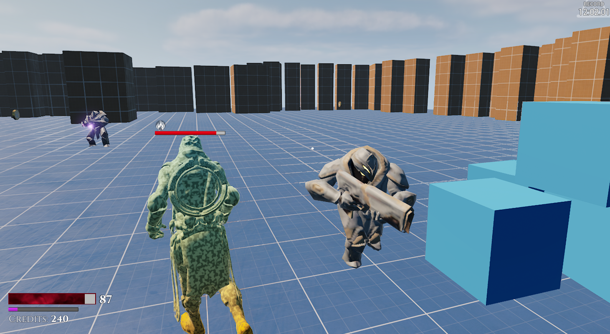
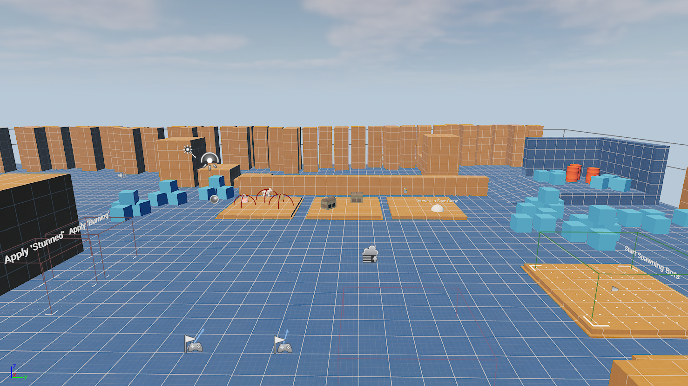

# Action Roguelike Game (Project)

A Base Project to Build a online Wizard Action Game
# Project View


# Project Features
- Third-person Action Character Movement
- **Enhanced Input**
- **Action System** (similar to Gameplay Ability System in design)
  - Dash Ability (Teleporting via projectile)
  - Blackhole Ability
  - Magic Projectile Attack
  - "Thorns" buff (reflecting damage)
  - Burning Damage-over-time effect
- AttributeComponent (Holding health etc.)
- **SaveGame System** for persisting progress of character and world state.
- Event-based logic to drive UI and gameplay reactions.
- Mix of C++ & Blueprint and how to combine them effectively.
- **GameplayTags** to mark-up Actors, Buffs, Actions.
- **Multiplayer support** for all features
- GameMode Logic
  - EQS for binding bot/powerup spawn locations.
  - Bot spawning system (bots cost points to spawn, gamemode gains points over time to spend)
  - DataTable holds bot information
  - DataAssets to hold enemy configurations
- **Asset Manager:** Async loading of data assets
- Async loading of UI icons
- AI
  - Minion AI with Behavior Trees (Roam, See, Chase, Attack, Flee/Heal)
  - C++ Custom Behavior Trees Nodes
  - EQS for attack/cover locations by AI
- Powerups
  - Powerup pickups to heal, gain credits/actions.
-UMG
  - Main menu to host/join game
  - UI elements for player attributes and projected widgets for powerups and enemy health.
  - C++ Localized Text
- Experimental / WIP
  - Aggregate Ticking (Projectiles)
  - Actor Pooling (Projectiles)
- Async Line tracing Example

# Unreal Engine 5

With the release of UE5, some new rendering features have been enabled. For lower end machines it may be required to turn these off. You can do so via the Project Settings or the config INI.

### DefaultEngine.ini

````[/Script/Engine.RendererSettings]
r.ReflectionMethod=1 ;lumen reflection
r.GenerateMeshDistanceFields=True
r.DynamicGlobalIlluminationMethod=1 ;lumen global illumination
r.Shadow.Virtual.Enable=1 ;virtual shadow maps

[/Script/WindowsTargetPlatform.WindowsTargetSettings]
DefaultGraphicsRHI=DefaultGraphicsRHI_DX12 // Use DX12 for new rendering features above
````
